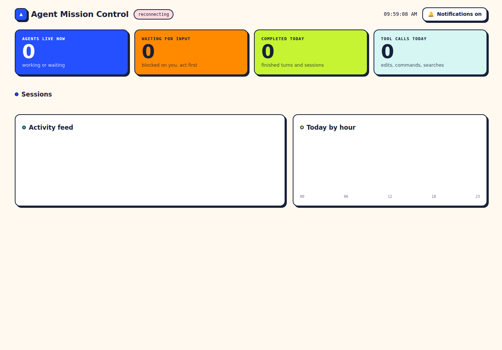

# Agent Deck

A local dashboard that shows every AI coding agent session running on your Mac:
what each one is working on, how many are live, which model and project, and
which ones are blocked waiting for your input. Everything runs on your machine.
Nothing leaves it. No cloud, no accounts.

Supports Claude Code (terminal + desktop), Cursor, Codex (desktop + CLI),
Kiro (beta), and your own Python bots or ETL jobs.



---

## Quick start

```bash
cd agent-mission-control
python3 -m pip install -r requirements.txt
python3 app.py                 # serves http://localhost:7777
```

Open http://localhost:7777. Then wire your agents once:

```bash
python3 install_hooks.py       # adds hooks for Claude Code, Cursor, Codex
```

Restart any agent apps that were already open so they pick up the new hooks.

Test it without any real agent:

```bash
python3 scripts/fake_agent.py  # two demo sessions animate on the dashboard
```

Run on your second MacBook the same way: copy the folder, `pip install`,
`python3 install_hooks.py`. Each machine is independent.

---

## How agents connect

Four intake paths feed one server. You do not need all of them; each works alone.

| Agent | Path | How it is wired |
|---|---|---|
| Claude Code (terminal) | Native hooks + session-log tailing | `install_hooks.py` writes to `~/.claude/settings.json`. Even with no hooks, the JSONL transcript tailer picks sessions up. |
| Cursor | Agent hooks (beta) | `install_hooks.py` writes to `~/.cursor/hooks.json`, pointing at `hooks/cursor_hook.sh`. |
| Codex (desktop + CLI) | Session-log tailing + `notify` | Tailer reads `~/.codex/sessions/`. `install_hooks.py` adds a `notify` line to `~/.codex/config.toml` for instant waiting-for-input alerts. |
| Kiro (beta) | Agent hook forwarder | Kiro's Agent Hooks are per-workspace and set in Kiro's UI, so there's no global file to auto-edit. `install_hooks.py` prints how to point a hook at `hooks/kiro_hook.sh`, which forwards to `/ingest/kiro/{event}`. |
| Custom Python bots / ETL | Generic webhook | No install. POST to `http://localhost:7777/ingest`. See below. |

### Reporting from your own scripts

Three lines. Call it whenever state changes:

```python
import json, urllib.request
def report(**kw):
    urllib.request.urlopen(urllib.request.Request(
        "http://localhost:7777/ingest",
        data=json.dumps(kw).encode(),
        headers={"Content-Type": "application/json"}), timeout=2)

report(agent="custom", session_id="gold-etl", status="working",
       task="Fetching daily gold snapshot", model="claude-sonnet-4-6",
       project="gold-dashboard")
# ...later...
report(agent="custom", session_id="gold-etl", status="completed",
       summary="Loaded 1,204 rows", tokens_in=52000, tokens_out=8100)
```

Accepted `status` values: `working`, `waiting_input`, `idle`, `error`,
`completed`. Only `agent` and `session_id` are required. Optional `tokens_in`
/ `tokens_out` feed the cost tracker.

---

## Status meanings

| Status | Means |
|---|---|
| Working | Activity in the last 30s |
| Waiting for you | Blocked on an approval or input prompt. Orange, pulsing. This is the one to watch. Stays visible up to 2h even while silent — a blocked agent is silent by definition. |
| Idle | Quiet 30s to 10 min, or a Claude Code turn just finished |
| Ended | Session closed (Claude Code `SessionEnd`), or silent over 10 min |
| Error | Reported a failure |

Thresholds are constants at the top of `app.py` (`WORKING_S`, `IDLE_S`,
`WAITING_TTL_S`).

---

## Notifications

Browser notifications fire when any agent starts waiting for input or errors.
The bell in the header mutes everything in one click, and the setting is
remembered. First time you leave it on, your browser will ask permission.

---

## Allow / deny (gating)

Approve or reject an agent's action from the dashboard instead of switching to
its terminal. Gating is **opt-in per session**: each Claude Code and Cursor card
has a **Gate** toggle (default off). Ungated sessions behave exactly as before.

When you turn gating on for a session, its next command/tool call pauses and the
card shows the concrete action (e.g. `Bash rm -rf build/`) with **Allow** and
**Deny** buttons. Click one and the agent proceeds or is refused. If you do not
answer within `GATE_TIMEOUT_S` (120s), or the dashboard is down, the agent falls
back to its own normal permission prompt — gating never blocks an agent
permanently. Only an explicit Deny stops an action.

| Agent | Gating |
|---|---|
| Claude Code | Full (via the `PreToolUse` hook `cc_gate.py`, which also reports tool activity) |
| Cursor | Shell/MCP executions (beta) |
| Codex | Not supported — its `notify` is one-way, so it can't wait for a remote decision. Codex still shows its waiting-for-approval state; you approve in Codex itself. |
| Kiro | Deferred until validated against a live install |

---

## History, tokens & cost

The **History** button in the header shows a per-day digest of the last 30
days: events, tool calls, completions, tokens, and an estimated cost. The
"Tokens today" tile shows the running total.

Token usage is collected automatically from Claude Code transcripts and Codex
rollout logs (beta), and from custom bots that report `tokens_in`/`tokens_out`
on `/ingest`. Costs are **estimates** from the static `PRICES` table at the
top of `app.py` (USD per MTok, substring-matched on model name) — edit it when
prices change. Cache discounts are not modeled; unknown models show tokens
without a cost.

## Retention

Raw events older than 14 days are rolled up into per-day aggregates (so
History keeps working) and deleted; decisions and ended sessions are pruned
after 30 days. `EVENTS_RETAIN_DAYS` / `SESSIONS_RETAIN_DAYS` in `app.py`.

---

## Menu bar (optional)

`scripts/amc.5s.sh` is a SwiftBar/xbar plugin. Install
[SwiftBar](https://github.com/swiftbar/SwiftBar), drop the script in your
plugins folder, and the menu bar shows `Deck 3●` with a `!` when something is
waiting. Reads the same `/summary` endpoint the dashboard uses.

The notch overlay idea is a later, separate native app. It will read `/summary`
too, so nothing here needs to change for it.

---

## Endpoints

| Endpoint | Purpose |
|---|---|
| `GET /` | Dashboard |
| `GET /api/state` | Full state snapshot (also the polling fallback) |
| `GET /api/session/{id}/events` | One session's full timeline |
| `GET /api/daily` | Events per day per agent, last 7 days (feeds the 7-day panel) |
| `GET /api/history?days=30` | Per-day digest: events, tool calls, tokens, est. cost |
| `GET /summary` | Compact counts for menu bar / notch |
| `WS /ws` | Live push |
| `POST /ingest` | Generic webhook |
| `POST /gate/{agent}` | Gated hook long-polls here for an allow/deny decision |
| `POST /api/decision/{id}` | Resolve a pending decision (`{"action":"allow"\|"deny"}`) |
| `POST /api/session/{id}/gate` | Turn gating on/off for a session (`{"on":true\|false}`) |

---

## Run it on login (optional)

```bash
cp scripts/com.aidill.amc.plist ~/Library/LaunchAgents/
# edit the path inside first, then:
launchctl load ~/Library/LaunchAgents/com.aidill.amc.plist
```

---

## Notes and limits

- Mostly read-only. It watches by default; the one control it has is opt-in
  allow/deny gating (see above), which is off unless you turn it on per session.
- Cursor hooks are beta. If Cursor sessions never appear, its hook event names
  may have changed. Fix them in `~/.cursor/hooks.json`; only that one adapter is
  affected. Claude Code and Codex are unaffected.
- Kiro is beta and was wired against Kiro's documented agent-hook shape without a
  live install to test against. The `/ingest/kiro/{event}` normalizer matches
  field names defensively; if events look wrong, adjust `handle_kiro` in `app.py`.
- Chat apps (Claude Desktop, ChatGPT) are **not** tracked and can't meaningfully
  be. They're conversational, not agentic coding sessions: no local hooks, and
  no session transcripts on disk (conversations live server-side; what's on disk
  is opaque Chromium storage). They also lack the "working → waiting for you →
  done" lifecycle the dashboard is built around. The only sensible integration
  would be a custom MCP server reporting tool activity via the `/ingest` webhook.
- Log paths assumed: `~/.claude/projects/`, `~/.codex/sessions/`. If Codex
  writes elsewhere on your setup, adjust the glob in `app.py`.
- Localhost only. No auth, because nothing is exposed off your machine.

## Tests

```bash
python3 -m pip install pytest httpx
pytest -q
```

Covers status derivation, the intake normalizers, log-tailer rotation
recovery, and the HTTP endpoints.

## Uninstall

Restore the `*.amc.bak` files the installer created, or delete any config lines
containing `agent-mission-control`.
